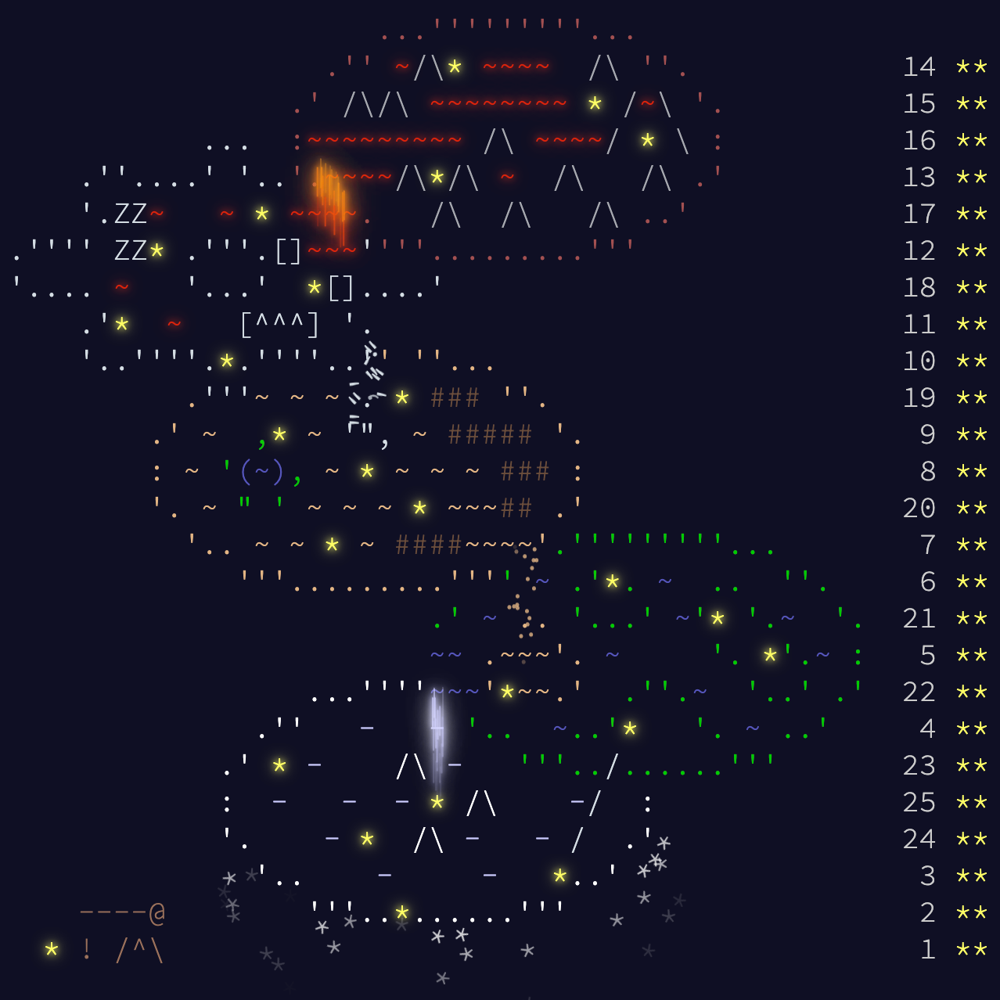

# Advent of Code

> Advent of Code is an Advent calendar of small programming puzzles for a variety of skill sets and skill levels that can be solved in any programming language

-- Eric Wastl, Advent of Code maker

I do it with friends and colleagues, and it's always fun to discuss our solutions. Here are my attempts.

A non-exhaustive list of some used algorithms / math background :

- [Minimum_cut](https://en.m.wikipedia.org/wiki/Minimum_cut) with [Karger's_algorithm](https://en.m.wikipedia.org/wiki/Karger%27s_algorithm)
- [Shoelace_formula](https://en.wikipedia.org/wiki/Shoelace_formula)
- [Pick's_theorem](https://en.wikipedia.org/wiki/Pick%27s_theorem)
- [Reverse_Polish_notation](https://en.wikipedia.org/wiki/Reverse_Polish_notation)
- [Shunting_yard_algorithm](https://en.wikipedia.org/wiki/Shunting_yard_algorithm)
- [Quadratic_form](https://en.wikipedia.org/wiki/Quadratic_form)
- [Taxicab_geometry](https://en.wikipedia.org/wiki/Taxicab_geometry)
- [Chinese_remainder_theorem](https://en.wikipedia.org/wiki/Chinese_remainder_theorem)
- [Dijkstra's_algorithm](https://en.wikipedia.org/wiki/Dijkstra%27s_algorithm)

## 2023 Edition -> 50 :star2: :tada:

